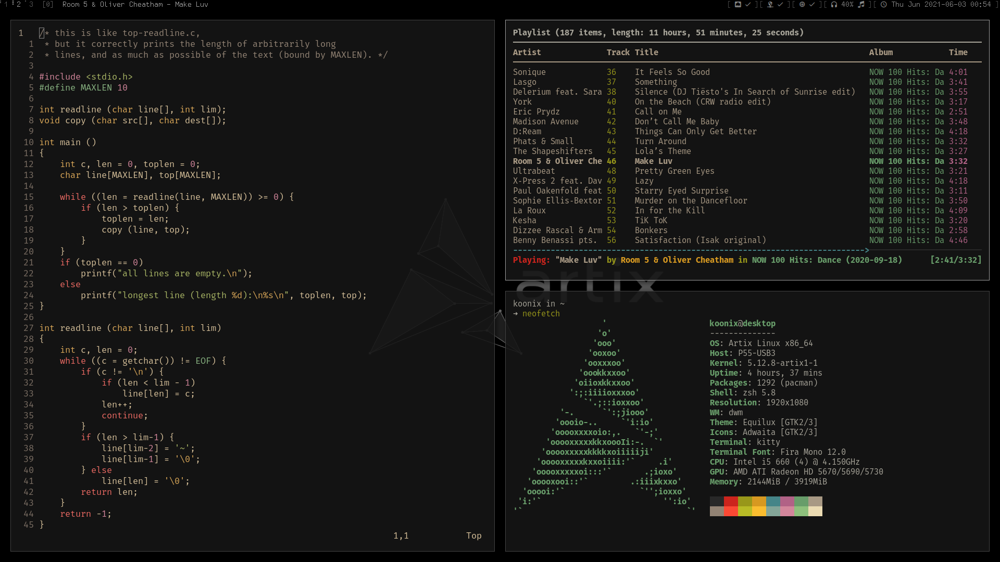

# dotfiles

looks like this:

also check out these stuff:

- my dwm build: [soystemd/dwm](https://github.com/soystemd/dwm)
- my statusbar: [soystemd/dwmBar](https://github.com/soystemd/dwmbar)
- dmenu: [soystemd/dmenu](https://github.com/soystemd/dmenu)
- slock: [soystemd/slock](https://github.com/soystemd/slock)
- sxiv: [soystemd/sxiv-flexipatch](https://github.com/soystemd/sxiv-flexipatch)
